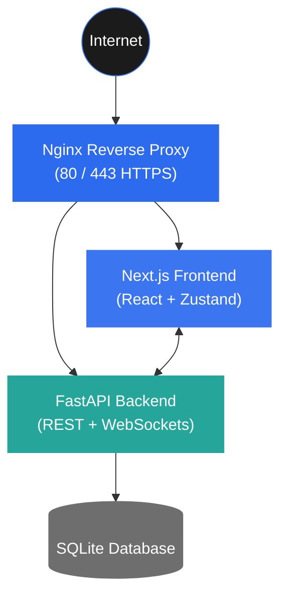
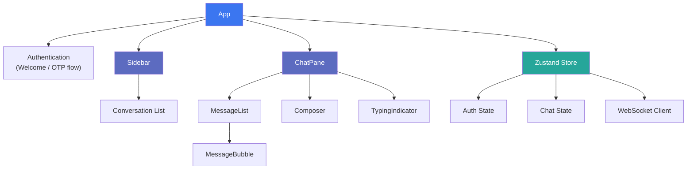
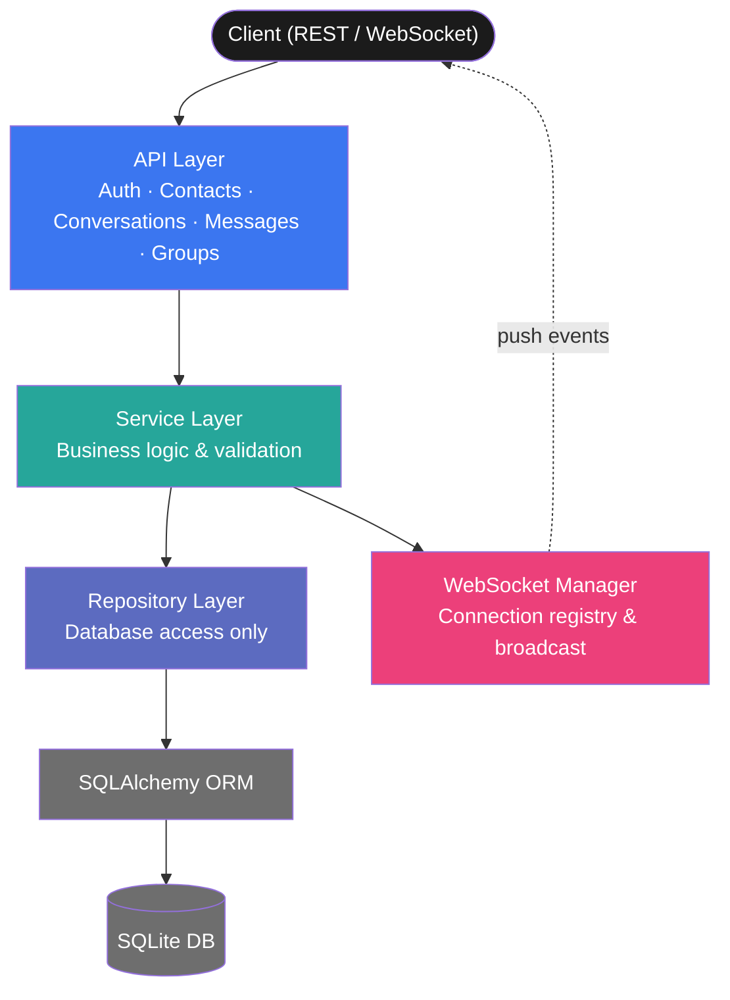
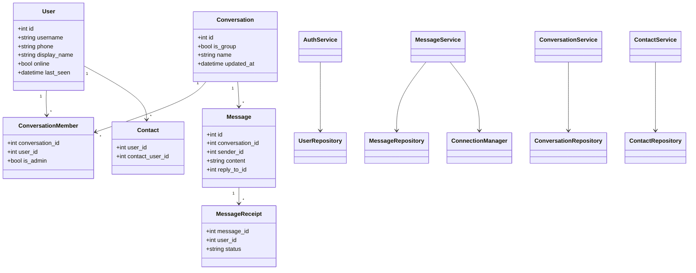
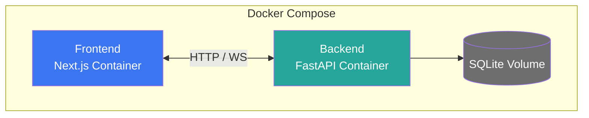
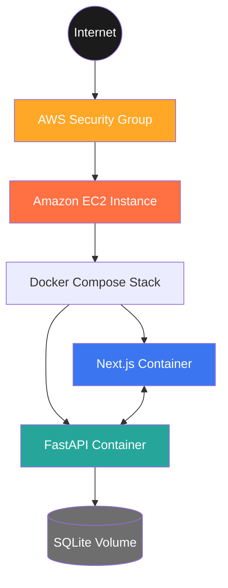

# Signal Clone

A full-stack real-time messaging application inspired by Signal, built using FastAPI, Next.js, WebSockets, and Docker. The project demonstrates scalable backend architecture, real-time communication, containerized deployment, and modern frontend development.

## 🟢 Live Demo

### Frontend

**Application:** http://18.234.140.123:3000


### Demo Credentials

> **OTP (Mock):** `000000`

| Phone | Username |
|--------|----------|
| +15550000001 | alice |
| +15550000002 | bob |
| +15550000003 | carol |
| +15550000004 | dave |
| +15550000005 | erin |

> Register with any of the above phone numbers and use the OTP `000000` to authenticate.
---

# Features

- JWT Authentication
- OTP-based Login (Mock)
- One-to-One Messaging
- Group Chats
- Real-time Messaging via WebSockets
- Read Receipts
- Typing Indicators
- Message Reactions
- Responsive UI
- Dockerized Deployment
- AWS EC2 Deployment

---

# Tech Stack

## Frontend

- Next.js 14
- React
- TypeScript
- Zustand
- TailwindCSS

## Backend

- FastAPI
- SQLAlchemy
- SQLite
- WebSockets
- JWT Authentication
- Pydantic

## Infrastructure

- Docker
- Docker Compose
- AWS EC2
- Nginx (Reverse Proxy)

---

# System Architecture



---

# Frontend Architecture



---

# Backend Architecture



---

# Class Design



---

# Docker Architecture



---

# AWS Deployment



---

# API Documentation

Swagger

```
http://localhost:8000/docs
```

---

> **Note**
>
> This project was designed and implemented within a **24-hour development window**. The system architecture, technology stack, and implementation choices were selected to meet the project scope, timeline, and functional requirements within that constraint.
>
> For a production-scale deployment, the architecture and technology stack may evolve based on factors such as expected traffic, scalability, availability, security, maintainability, and business requirements. Components such as the database, caching layer, message broker, deployment strategy, and infrastructure would be selected according to the application's scale and operational needs.

---

# Running Locally

```bash
git clone https://github.com/Akash4467/Signal-clone.git

cd Signal-clone

docker compose up --build
```

---

# Deployment

The project is deployed using

- Docker Compose
- Amazon EC2
- Nginx Reverse Proxy

---

# Future Improvements

- End-to-End Encryption
- Media Sharing
- Voice Calling
- Video Calling
- Push Notifications
- PostgreSQL Support
- Kubernetes Deployment
